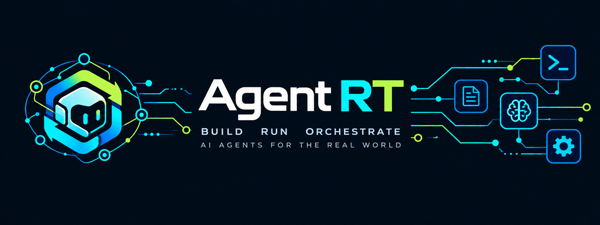

**A fast, lightweight runtime for building production AI agents in Python and TypeScript.** ⚡

Agent RT gives agents a clear execution boundary for **tools, streaming, structured output, permissions, approvals, memory, checkpoints, sandboxing, observability, and deployment**—without requiring a heavyweight orchestration stack.

> **One runtime. Two languages. Any model provider. Production controls built in.** 🧩

[](https://pypi.org/project/agent-rt/)
[](https://www.npmjs.com/package/agent-rt)
[](https://agent-rt-pro.github.io/docs/)
[](https://github.com/Pro-GenAI/Agent-RT/blob/main/LICENSE)

## 🚀 Quick Start

**Python**

```bash
pip install agent-rt
```

**TypeScript / Node.js**

```bash
npm install agent-rt
```

➡️ [Installation](docs/website/docs/getting-started/installation.html) · [Quickstart](docs/website/docs/getting-started/quickstart.html)

## ✨ Why Agent RT?

- 🪶 **Lightweight and measurable** — start with the runtime core and add integrations only when needed; reproducible cross-framework benchmarks live in [`comparison/`](comparison/README.md).
- 🛡️ **Controlled** — permissions, approvals, limits, guardrails, and sandbox boundaries are runtime concepts, not add-ons.
- 🔌 **Provider-neutral, two languages** — OpenAI, Anthropic, compatible endpoints, or custom providers, with aligned contracts in  Python and  TypeScript.

**Decision models** (such as Laya and other Jev-compatible models) answer typed choice/score questions for runtime control-plane gates instead of generating text: pruning the tool catalog, gating memory and retrieval, and classifying failures.

## ⚖️ Quick Comparison

| | ⚡ Agent RT | 🦜 LangChain | 🗂️ LlamaIndex |
| --- | --- | --- | --- |
| **🎯 Primary focus** | 🧠 Agent runtime | 🧩 App/orchestration framework | 📚 Data & RAG framework |
| ** Python +  TypeScript** | ✅ | ✅ | ✅ |
| **🛠️ Tools & agent loop** | ✅ Built-in | ✅ | ✅ |
| **🔐 Permissions & approvals** | ✅ Built-in | ◐ | ◐ |
| **🛡️ Agent Action Guard** | ✅ Built-in integration (opt-in) | — | — |
| **🧰 API & CLI tools** | ✅ Built-in (optional packages) | — | — |
| **🌐 OpenAI + Anthropic compatible API** | ✅ Built-in server adapters | ◐ Integration-dependent | ◐ Integration-dependent |
| **🧠 Decision-model control gates** | ✅ Tool pruning, memory/retrieval gates, failure classification | — | — |
| **✂️ Tool catalog pruning before model call** | ✅ Built-in | ◐ Integration-dependent | ◐ Integration-dependent |
| **📦 Sandboxing** | ✅ Fail-closed backend selection | ◐ | ◐ |
| **♻️ Budget-preserving checkpoints** | ✅ Resume with prior turn/tool/token budgets | ◐ | ◐ |
| **💾 Memory & checkpoints** | ✅ Built-in | ✅ | ✅ |
| **🗃️ Switch vector DBs** | ✅ Simple env/registry switch | ◐ Integration-dependent | ◐ Integration-dependent |
| **🔌 Provider-neutral** | ✅ | ✅ | ✅ |
| **🪶 Lightweight runtime focus** | ✅ | ◐ | ◐ |
| ** Fresh install footprint** | **46.43 MiB** | 69.87 MiB | 219.91 MiB |
| ** Warm latency** | **1.56 ms** | 9.03 ms | 4.26 ms |
| ** Runtime memory** | **+5.86 MiB** | +19.77 MiB | +22.42 MiB |
| ** Fresh install footprint** | **1.24 MiB** | 82.44 MiB | 60.38 MiB |
| ** Warm latency** | **1.85 ms** | 2.60 ms | 2.23 ms |
| ** Runtime memory** | **+14.33 MiB** | +17.27 MiB | +16.79 MiB |

**✅ Built-in · ◐ Available / integration-dependent · — Not a primary focus**

📊 [See reproducible benchmarks →](comparison/README.md)

## 🧪 See It in Action

A tool the model may call, restricted by a capability grant and a model-call budget (Python shown; see the [TypeScript package](typescript/README.md) for the npm quick start):

```python
registry = ToolRegistry()
registry.register(
    ToolDefinition(
        name="get_weather",
        description="Get the current weather for a city.",
        input_schema={
            "type": "object",
            "required": ["city"],
            "properties": {"city": {"type": "string"}},
            "additionalProperties": False,
        },
        side_effect="read",
    ),
    handler=get_weather,  # async (arguments, cancellation_token) -> dict
)

loop = AgentLoop(
    load_model(),  # OpenAI, Anthropic, or any compatible endpoint
    tool_registry=registry,
    capability_grant=CapabilityGrant(tools=("get_weather",)),
    execution_budget=ExecutionBudget(ExecutionBudgetLimits(max_model_calls=5)),
)
result = await loop.run(agent, messages)
```

Arguments are validated against the schema, tools outside the grant never run, and the budget stops runaway loops. Full runnable versions are in the [examples](python/examples/README.md).

## 📚 Learn More

| Topic | Documentation |
| --- | --- |
| Runtime model | [How Agent RT executes agents](docs/website/docs/concepts/runtime.html) |
| Tools & safety | [Tools, policy, permissions, approvals, and guardrails](docs/website/docs/concepts/tools-policy.html) |
| State & memory | [State, memory, checkpoints, and artifacts](docs/website/docs/concepts/state-memory.html) |
| Production | [Sandboxing, observability, evaluation, and deployment](docs/website/docs/guides/production.html) |
| Migration | [LangChain, LlamaIndex, OpenAI, and Anthropic migration](docs/website/docs/guides/migration.html) |
| Runtime guide | [Providers, API server, CLI, sandboxes, skills, and migration entry points](docs/website/docs/guides/runtime-guide.html) |
| Features | [Features, defaults, and configuration](docs/website/docs/reference/features-defaults.html) |
| Architecture | [Architecture and extension contracts](docs/website/docs/reference/architecture.html) |
| Development | [Contributor setup and test workflows](docs/website/docs/reference/development.html) |

🌐 **Full documentation:** [agent-rt-pro.github.io/docs](https://agent-rt-pro.github.io/docs/)

## 📦 Packages

[Python](python/README.md) · [TypeScript](typescript/README.md) · [Python examples](python/examples/README.md) · [TypeScript examples](typescript/examples/README.md)

The inbound API server, terminal CLI, and AutoGen/CrewAI migration shims are Python-only.

## 📄 License

MIT — see [LICENSE](LICENSE).

---

<p align="center">

<br>
<em>Projects for Next-Gen AI</em>
</p>
