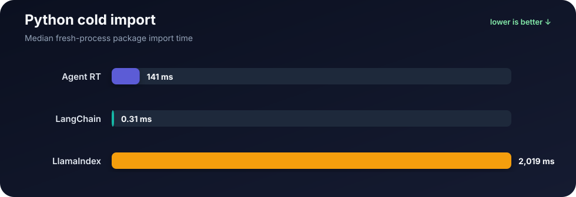
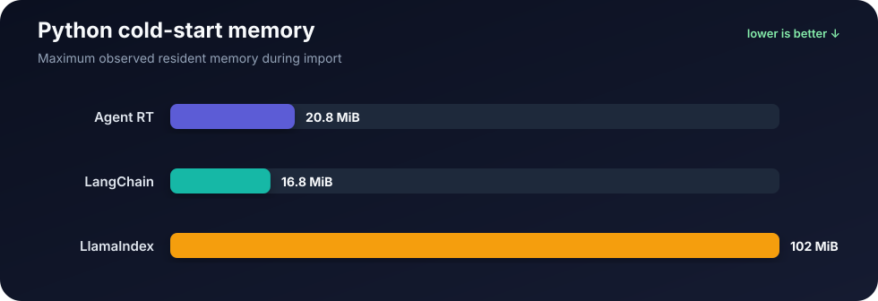
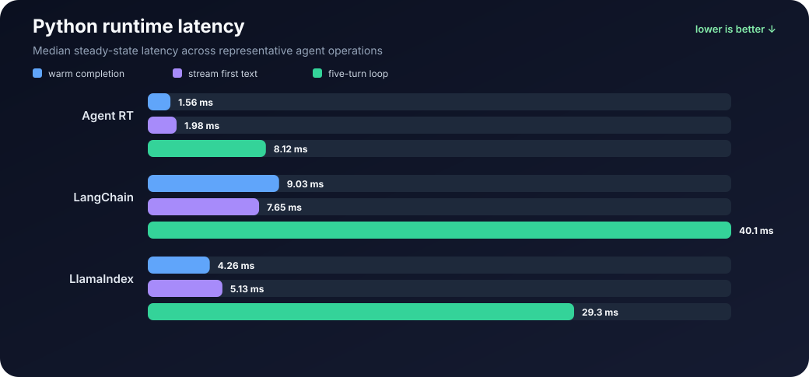
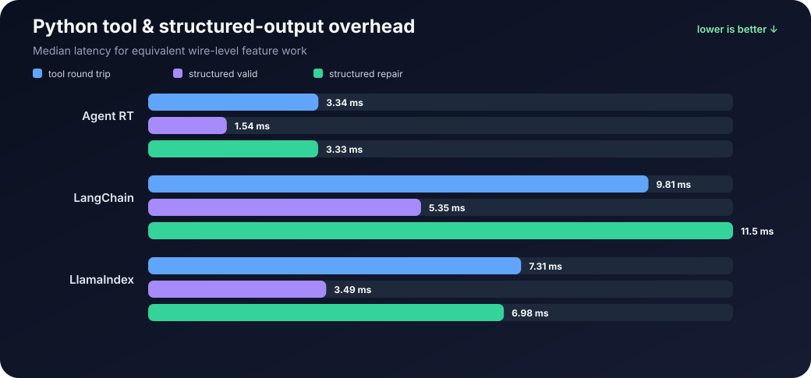
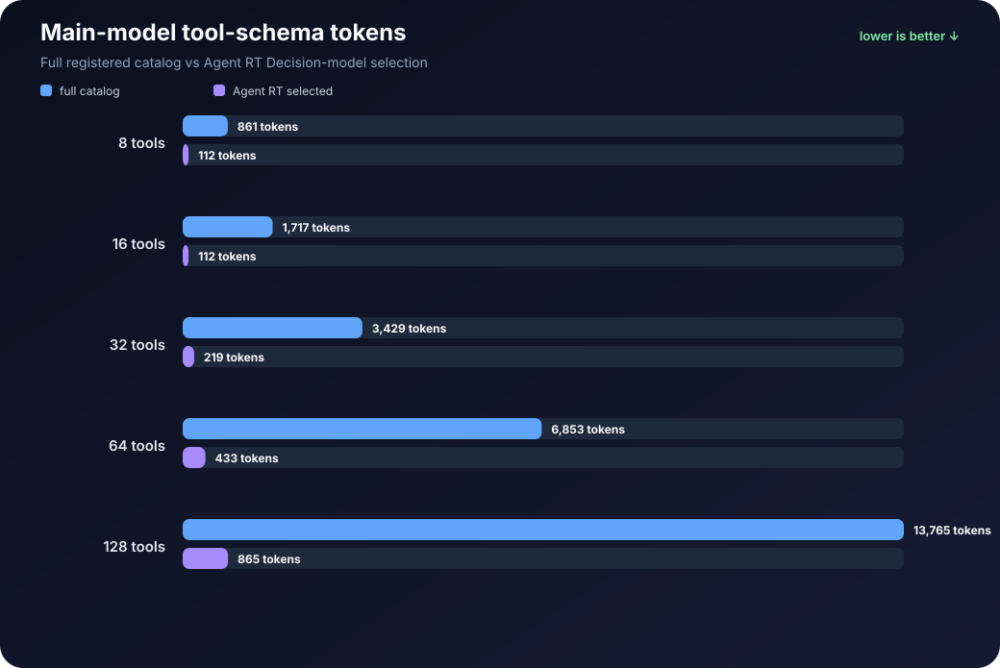

# Framework comparison

Agent RT is designed to keep agent runtime overhead small without giving up the production features that matter: tool execution, streaming, structured output, permissions, memory, orchestration, and observability.

This comparison tracks reproducible measurements against popular Python and TypeScript alternatives. The goal is not to manufacture a single “winner” score. It is to show where runtime weight, latency, memory, and tool-schema overhead actually appear in practical scenarios.

For implementation-specific benchmark notes, see the [Python comparison](python/README.md) and [TypeScript comparison](typescript/README.md).

## What the measurements show

Across the measured runtime scenarios, Agent RT combines low warm-request latency with comparatively small runtime memory growth. In the TypeScript cold-load benchmark it also loads substantially faster and with less memory than the measured LangChain.js and LlamaIndex.TS entry points. In Python, cold-import results are more nuanced because the top-level `langchain` package is extremely lazy, but Agent RT remains much lighter than the measured LlamaIndex entry point.

The feature benchmarks show the same pattern on common agent work: tool round trips, repeated tool loops, structured-output validation/repair, and repeated schema requests. Agent RT also reduces the tool schema sent to the main model when its Decision-model tool-selection path is used, which can materially reduce main-model context usage for large tool catalogs.

All figures below are scenario-specific measurements, not universal framework rankings.

## Benchmark environment

| Item | Value |
| --- | --- |
| OS | Linux x86_64, kernel 7.0.0-34-generic |
| Python | 3.13.13 |
| Node.js | 22.22.2 |
| Agent RT | 0.0.1 |
| Python LangChain | 1.4.2 |
| Python LlamaIndex | 0.14.25 |
| LangChain.js | 1.5.12 |
| LlamaIndex.TS | 0.12.1 |

## Cold package import / module load

Each result is based on **30 successful cold-process runs per framework**. The benchmark is provider-free so network and model latency do not affect the result.

### Python

The measured Python entry points are `agent_rt`, `langchain`, and `llama_index.core`.

| Framework | Fresh install | Median import | p95 import | Median process total | Median CPU | Median RSS delta | Max peak RSS |
| --- | ---: | ---: | ---: | ---: | ---: | ---: | ---: |
| Agent RT | 46.43 MiB | 141.4 ms | 161.9 ms | 256.6 ms | 100.0% | 4.2 MiB | 20.8 MiB |
| LangChain + OpenAI + Anthropic addons | 69.87 MiB | 0.3 ms | 0.4 ms | 98.2 ms | 101.6% | 0.0 MiB | 16.8 MiB |
| LlamaIndex + OpenAI + Anthropic addons | 219.91 MiB | 2019.1 ms | 2805.6 ms | 2504.0 ms | 154.8% | 85.4 MiB | 101.9 MiB |





Checked-in aggregate data: [`python/measured-results.csv`](python/measured-results.csv) and [`python/install-size-measured-results.csv`](python/install-size-measured-results.csv). Fresh-install footprint was measured on 2026-10-03 with Python 3.13.13 from clean `uv venv` environments using copy mode; values are logical installed bytes above the empty-venv baseline and include transitive dependencies.

The Python `langchain` top-level package is very lightweight/lazy in this package version. Its import result measures that package entry point only and should not be interpreted as the startup cost of a fully constructed LangChain agent stack.

### TypeScript

The measured TypeScript entry points are the local Agent RT build, `langchain`, and `llamaindex`.

| Framework | Fresh install | Median module load | p95 module load | Median process total | Median CPU | Median RSS delta | Max observed RSS |
| --- | ---: | ---: | ---: | ---: | ---: | ---: | ---: |
| Agent RT | 1.24 MiB | 64.4 ms | 77.1 ms | 152.2 ms | 185.1% | 13.3 MiB | 60.8 MiB |
| LangChain.js + OpenAI + Anthropic addons | 82.44 MiB | 496.5 ms | 616.1 ms | 577.4 ms | 137.1% | 41.9 MiB | 89.7 MiB |
| LlamaIndex.TS + OpenAI + Anthropic addons | 60.38 MiB | 983.6 ms | 1387.2 ms | 1075.6 ms | 149.9% | 138.4 MiB | 192.8 MiB |


Checked-in aggregate data: [`typescript/measured-results.csv`](typescript/measured-results.csv) and [`typescript/install-size-measured-results.csv`](typescript/install-size-measured-results.csv). Fresh-install footprint was measured on 2026-10-03 with Node.js 22.22.2 and npm 10.9.7 from clean temporary projects; Agent RT was installed from an `npm pack` tarball and each result measures logical `node_modules` bytes including transitive dependencies.

## Runtime/API comparison

The runtime benchmark uses deterministic localhost OpenAI-compatible responses and makes no external model/API calls. The checked-in tables below are the last **30-run HTTP/SSE baseline** captured on 2026-09-28. Agent RT's current default runtime path uses Responses WebSocket, so these historical values should be treated as a stable reference baseline rather than compared directly with newly generated WebSocket results.

### Python runtime results

| Framework | Worker module load | First construction | Subsequent construction | First completion | Warm completion | Warm completion p95 | Warm stream first text | 100-request avg | Runtime RSS delta |
| --- | ---: | ---: | ---: | ---: | ---: | ---: | ---: | ---: | ---: |
| Agent RT | 125.41 ms | 0.08 ms | 0.016 ms | 81.58 ms | 1.56 ms | 1.77 ms | 1.98 ms | 1.70 ms | 5.86 MiB |
| LangChain | 2374.36 ms | 710.49 ms | 0.51 ms | 105.62 ms | 9.03 ms | 11.36 ms | 7.65 ms | 5.44 ms | 19.77 MiB |
| LlamaIndex | 2939.61 ms | 0.32 ms | 0.03 ms | 662.68 ms | 4.26 ms | 5.35 ms | 5.13 ms | 4.08 ms | 22.42 MiB |

For Agent RT, RSS was 28.14 MiB after framework import and 33.47 MiB after the first completion, reaching 34.00 MiB by the end of the five-turn phase. Overall runtime RSS growth was 5.86 MiB in this capture.

Checked-in aggregate: [`python/runtime-measured-results.csv`](python/runtime-measured-results.csv).



### TypeScript runtime results

| Framework | Worker module load | First construction | Subsequent construction | First completion | Warm completion | Warm completion p95 | Warm stream first text | 100-request avg | Runtime RSS delta |
| --- | ---: | ---: | ---: | ---: | ---: | ---: | ---: | ---: | ---: |
| Agent RT | 57.45 ms | 0.69 ms | 0.005 ms | 52.42 ms | 1.85 ms | 2.31 ms | 1.48 ms | 0.98 ms | 14.33 MiB |
| LangChain.js | 524.21 ms | 1.37 ms | 0.054 ms | 58.32 ms | 2.60 ms | 3.67 ms | 2.52 ms | 1.54 ms | 17.27 MiB |
| LlamaIndex.TS | 688.84 ms | 0.33 ms | 0.006 ms | 91.95 ms | 2.23 ms | 2.64 ms | 1.80 ms | 1.12 ms | 16.79 MiB |

Checked-in aggregate: [`typescript/runtime-measured-results.csv`](typescript/runtime-measured-results.csv).


## Tool-call and structured-output results

These measurements cover tool round trips, repeated tool loops, valid structured output, repair after an invalid structured response, and repeated schema requests. The tables are **30-run** unfiltered aggregates from 2026-09-28.

| Python framework | Tool round trip | Tool loop ×5 | Structured valid | Structured repair | Structured ×20 |
| --- | ---: | ---: | ---: | ---: | ---: |
| Agent RT | 3.34 ms | 16.07 ms | 1.54 ms | 3.33 ms | 34.40 ms |
| LangChain | 9.81 ms | 48.82 ms | 5.35 ms | 11.47 ms | 107.17 ms |
| LlamaIndex | 7.31 ms | 36.25 ms | 3.49 ms | 6.98 ms | 67.92 ms |

Checked-in aggregate: [`python/feature-measured-results.csv`](python/feature-measured-results.csv).



| TypeScript framework | Tool round trip | Tool loop ×5 | Structured valid | Structured repair | Structured ×20 |
| --- | ---: | ---: | ---: | ---: | ---: |
| Agent RT | 2.70 ms | 12.76 ms | 1.25 ms | 2.63 ms | 28.11 ms |
| LangChain.js | 3.33 ms | 16.01 ms | 1.58 ms | 3.32 ms | 33.00 ms |
| LlamaIndex.TS | 2.96 ms | 15.55 ms | 1.55 ms | 3.30 ms | 30.91 ms |

Checked-in aggregate: [`typescript/feature-measured-results.csv`](typescript/feature-measured-results.csv).


Because these frameworks expose different higher-level abstractions, the feature benchmark standardizes common OpenAI-compatible tool/schema work instead of treating the table as an overall framework score.

## Tool-schema token usage

Large tool catalogs can consume a meaningful part of the main model's context before the user request is even processed. Agent RT can use a Decision model to select a smaller relevant tool set before the main-model call.

| Registered tools | Full catalog → main LLM | Agent RT → main LLM | Saved main tokens | Reduction | Decision-model input | Same-tokenizer combined |
| ---: | ---: | ---: | ---: | ---: | ---: | ---: |
| 8 | 861 | 112 | 749 | 87.0% | 1,056.5 | 1,168.5 |
| 16 | 1,717 | 112 | 1,605 | 93.5% | 2,040.5 | 2,152.5 |
| 32 | 3,429 | 219 | 3,210 | 93.6% | 4,081 | 4,300 |
| 64 | 6,853 | 433 | 6,420 | 93.7% | 8,162 | 8,595 |
| 128 | 13,765 | 865 | 12,900 | 93.7% | 16,388 | 17,253 |

The main-model reduction is the relevant context-window/billing comparison when the Decision model is local or accounted for separately. The selector itself is not token-free: if both models were billed identically under the same tokenizer, this workload would not be a net total-token reduction.

Checked-in aggregate: [`python/tool-token-measured-results.csv`](python/tool-token-measured-results.csv).



## Agent RT transport A/B

Agent RT's lightweight OpenAI-compatible transport was also measured against the retained official-SDK path in 30-run single-framework diagnostics.

| Runtime | Transport | First completion | Warm completion | 100-request avg | Runtime RSS delta |
| --- | --- | ---: | ---: | ---: | ---: |
| Python | compatible (HTTPCore) | 78.04 ms | 2.03 ms | 1.76 ms | 5.86 MiB |
| Python | official SDK | 1305.81 ms | 3.24 ms | 5.54 ms | 57.72 MiB |
| TypeScript | compatible (native `fetch`) | 51.82 ms | 3.29 ms | 2.45 ms | 17.13 MiB |
| TypeScript | official SDK | 344.44 ms | 3.49 ms | 2.52 ms | 28.23 MiB |

These measurements support keeping the lightweight compatible transport as the default while retaining the official SDK as an explicit fallback for provider-specific behavior.

## How to read the numbers

Cold import/module-load measurements start a fresh process for each sample. Runtime measurements instead isolate framework loading and request execution inside the benchmark worker. CPU percentages are process CPU time divided by wall time, so values above 100% are possible when work spans multiple cores. RSS is resident process memory.

Most importantly, these projects have different scopes and abstractions. Use the tables to reason about the measured scenarios, not as a universal framework ranking.

## Reproduce the benchmarks

Python:

```bash
cd comparison/python
uv sync
uv run python benchmark_imports.py --runs 30
uv run python benchmark_install_size.py --publish
uv run python benchmark_runtime.py --runs 30
uv run python benchmark_features.py --runs 30
uv run python benchmark_tool_tokens.py --publish
```

TypeScript:

```bash
cd typescript
npm run build
cd ../comparison/typescript
npm ci
node benchmark-imports.mjs --runs 30
node benchmark-install-size.mjs --publish
node benchmark-runtime.mjs --runs 30
node benchmark-features.mjs --runs 30
```

The checked-in CSV files linked above contain the published aggregates used by this page. Per-runner flags, profiling, and scalability diagnostics are documented in the [Python](python/README.md) and [TypeScript](typescript/README.md) comparison READMEs.
